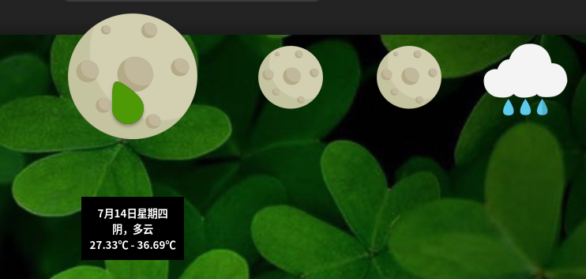
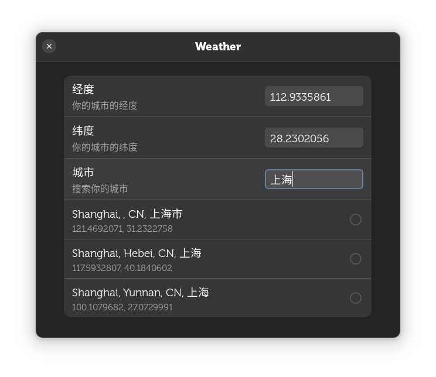

# gnome-shell-weather

## Animation Weather.

- Mouse 1: show weather
- Mouse 2: refresh weather
- Mouse 3: dismiss
- ScrollUp: increase day
- ScrollDown: decrease day

> Below Gnome 42, You need to fill in the correct longitude and latitude in the coord.json file.

> On Gnome 42, extension provide the config interface.

